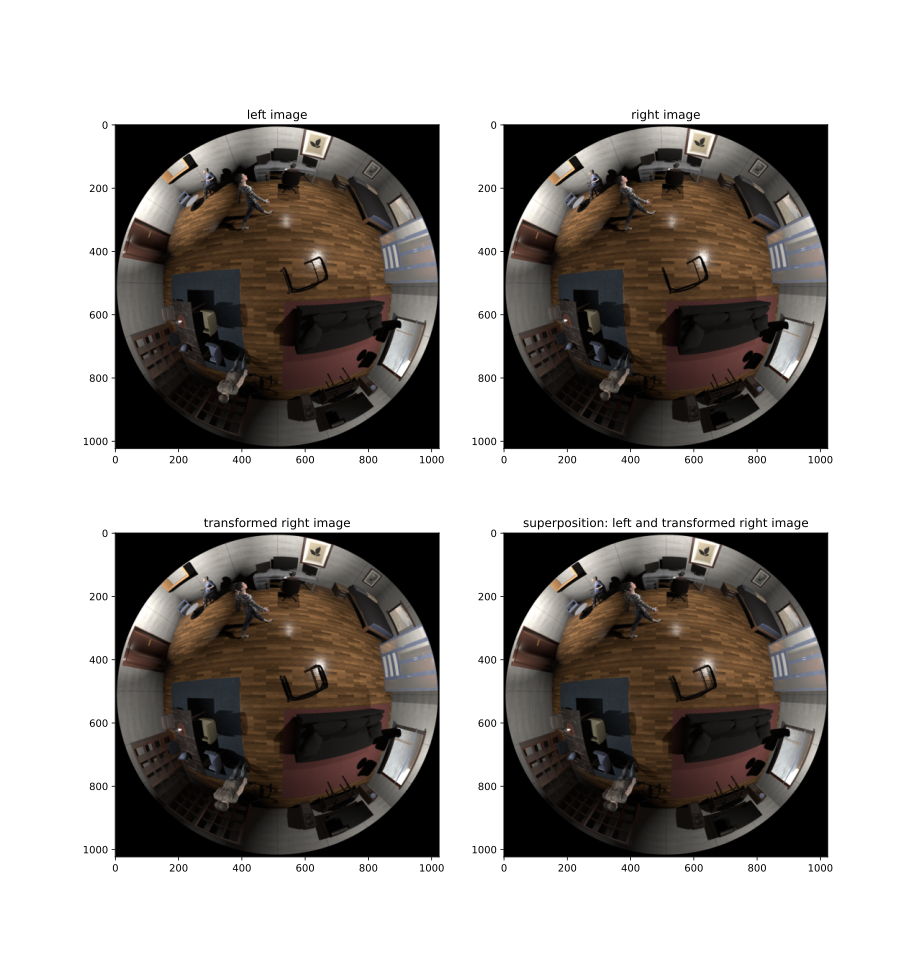

# OmniGlasses [Version 1: Equiangular Camera Model]

This repository implements OmniGlasses, the lookup tables of Omni-AnyNet [1].
This system is designed to allow omnidirectional image processing in CNNs originally designed for perspective stereo image pairs.
Instead of searching stereo correspondences on epipolar lines, the correspondences must be searched on epipolar curves.
OmniGlasses can be used for view synthesis and account for the curvy nature of the search space.
The current implementation assumes a canonical stereo camera setup which means that the cameras' x-axes (left-right) are collinear and the y-axes (top-down) are parallel.
Moreover, this implementation requires that the images underly the equiangular camera model ("perfect fisheye").
With the help of OmniGlasses, the right image or feature map is transformed to the left image or feature map assuming several omnidirectional disparity hypotheses. The disparity hypothesis that causes equal appearance in a certain region on left and transformed right feature map is a good choice for this region and can be refinened in a subsequent module.

The current implementation of OmniGlasses is tailored to the image processing of AnyNet [2]. Hence, there are three lookup tables for Stage 1 to 3.
The 4th stage constitutes an intelligent upsampling, does not search for correspondences and hence does not need a lookup table.

The recommend the interested reader to confer [1] for more details.

If you use the code or data generated by this code, please cite [1] and consider the License. Thank you.

## Shapes of the lookup table

| Stage                                 | Shape [D, B, H, W, {X or Y}] |
| ------------------------------------- | ---------------------------- |
| 0                                     | [12, 1, 64, 64, 2]           |
| 1                                     | [25, 1, 128, 128, 2]         |
| 2                                     | [51, 1, 256, 256, 2]         |
| (3) not necessary for Omni-AnyNet [1] | [201, 1, 1024, 1024, 2]      |

### Legend

D: number of disparities
B: Batch size (LUT should be repeated along this dimension for higher batch sizes)
H: image or feature map height
W: image or feature map width
{X,Y}: 0 for LUT in x-direction and 1 for LUT in y-direction

## Requirements

| library     | tested with version                           |
| ----------- | --------------------------------------------- |
| PyTorch     | 1.12.1                                        |
| TorchVision | 0.13.1                                        |
| NumPy       | 1.23.1                                        |
| Matplotlib  | 3.5.1                                         |
| PIL         | 9.2.0                                         |
| OpenEXR     | system library: 2.5.7; python bindings: 1.3.8 |

You can also use the conda environment `omni-anynet` generated by `prepare_machine.sh` of [Omni-AnyNet](https://github.com/hamza9305/Omni-AnyNet).

## Generation of OmniGlasses for Omni-AnyNet

Omni-Glasses for Omni-AnyNet [1] can be generated by:

`python main_Pytorch.py`

Supposed your GPU ram is not sufficient, try out `--device cpu`
This generates three LUTs for three stages and other tensors required by [1].

## Demo: View synthesis

The script `demo.py`  can be seen as a demonstration application for view synthesis based on the LUTs.
To produce high resolution outputs, this scripts needs the 4th LUT of another resolution that is usually omitted during generation.
Therefore, please regenerate the LUTs with:

` python main_Pytorch.py --num_stages 4`

Then run the demo script with:

`python demo.py --plot`

If you want to save the results (same directory), append `--save_plots` to the command.
Supposed your GPU ram is not sufficient, try out `--device cpu`

The output should look like the following:



As it can be seen from the figure above, the right image is successfully transformed to the perspective of the left camera. As the superposition is mainly sharp, this proves that left image and transformed right image coincide significantly. Blurred regions in the transformed right image or in the image superposition however can be seen as occlusion artifacts and cannot be traced back to the view synthesis itself. For more details, please confer [1].

## Scientific article
The article can be found [here](https://link.springer.com/10.1007/s00138-024-01534-2).

## References
[1] J. B. Seuffert, A. C. Perez Grassi, H. Ahmed, R. Seidel, and G. Hirtz, “OmniGlasses: an optical aid for stereo vision CNNs to enable omnidirectional image processing,” Machine Vision and Applications, vol. 35, no. 3, pp. 58–72, Apr. 2024, doi: 10.1007/s00138-024-01534-2.
[2] Y. Wang *et al.*, “Anytime Stereo Image Depth Estimation on Mobile Devices,” in *2019 International Conference on Robotics and Automation (ICRA)*, Montreal, QC, Canada, 2019, pp. 5893–5900. doi: [10.1109/ICRA.2019.8794003](https://doi.org/10.1109/ICRA.2019.8794003).  

## BibTeX

```bibtex
@article{seuffert_omniglasses_2024,
    title = {{OmniGlasses}: an optical aid for stereo vision {CNNs} to enable omnidirectional image processing},
    volume = {35},
    issn = {0932-8092, 1432-1769},
    shorttitle = {{OmniGlasses}},
    url = {https://link.springer.com/10.1007/s00138-024-01534-2},
    doi = {10.1007/s00138-024-01534-2},
    number = {3},
    urldate = {2024-05-07},
    journal = {Machine Vision and Applications},
    author = {Seuffert, Julian B. and Perez Grassi, Ana C. and Ahmed, Hamza and Seidel, Roman and Hirtz, Gangolf},
    month = apr,
    year = {2024},
    pages = {58--72}
}
```
